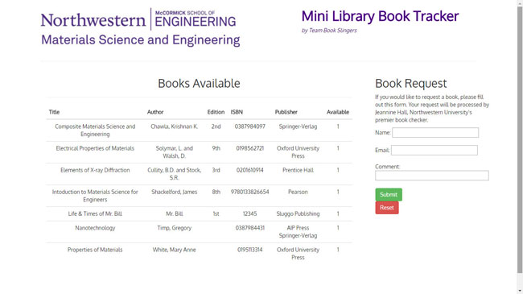
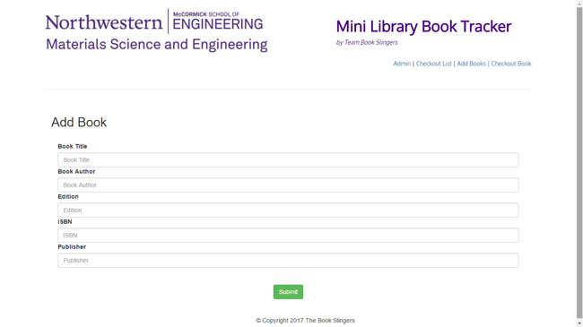

<<<<<<< HEAD
# Mini Library Book Tracker (MLBT) :blue_book:
=======
<<<<<<< HEAD
# Mini Library Book Tracker (MLBT) :blue_book:


### Description: Full-stack library application that efficiently tracks the books at the Northwestern University department of Material Science and Engineering. Facilitates access for students and faculty.


=======
# Mini Library Book Tracker :blue_book:
>>>>>>> linh


### Description: A full-stack library application that tracks the books at the Northwestern University department of Material Science and Engineering. Facilitates access for students and faculty.


### File Structure:

<<<<<<< HEAD
=======
>>>>>>> Darryl
>>>>>>> linh
```
File Structure Diagram

.
├── config
│   ├── connection.js
│   └── orm.js
│ 
├── controllers
│   └── mlbtracker_controller.js
│
├── db
│   ├── schema.sql
│   └── seeds.sql
│
├── models
│   └── mlbtracker.js
│ 
│ 
├── package.json
│
├── public
│   ├── assets
│   │   ├── css
│   │   │   └── mlbtracker_style.css
│   │   └── images
│   │       |
|   |       ├── addbook.jpg
|   |       |
|   |       ├── admin.jpg
|   |       |
|   |       ├── index.jpg
|   |       |
|   |       └── logo.jpg
│   |
|   |
|   └── test.html
│
├── server.js
│
└── views
    |   └──layouts
    |         └── main.handlebars
    |
    └── bookcheckout.handlebars
          ├── bookcrud.handlebars
          ├── checkout.handlebars
          ├── index.handlebars
          └── usercrud.handlebars           
               
```

- - -

<<<<<<< HEAD
### Technologies Used :package:: 
=======
<<<<<<< HEAD
### Technologies Used :package:: 
=======

### Technologies Used: 
>>>>>>> Darryl
>>>>>>> linh
<ul>
  <li>MySQL</li>
  <li>Node.js</li>
  <li>Express</li>
  <li>Handlebars</li>
<<<<<<< HEAD
  <li>ORM</li>  
=======
<<<<<<< HEAD
  <li>ORM</li>  
=======
  <li>ORM</li>
  
>>>>>>> Darryl
>>>>>>> linh
</ul>

- - - 

<<<<<<< HEAD
=======
<<<<<<< HEAD
>>>>>>> linh
### How to setup and use the MLBT :computer::

1. Open your command-line user interface (CLI)
2. Clone the <em>mlbt</em> repository to your computer in your desired file path
3. Configure the <code>connection.js</code> file to your MySQL Workbench settings
4. Type <code>node server.js</code> in CLI to connect to the server
5. For client-side view: Enter <code>localhost:[insert port number]</code> in the URL bar to load index page. For administrator view: add <code>/admin</code> or <code>/crud</code> paths to the local host URL to load administrator-side pages.

- - - 

### Working Application Images (note: the application has been updated since these images have been posted):

#  Client 

#  Adminstrator

#  Administrator

<<<<<<< HEAD
=======
=======
### How to use the application:
>>>>>>> Darryl
>>>>>>> linh

