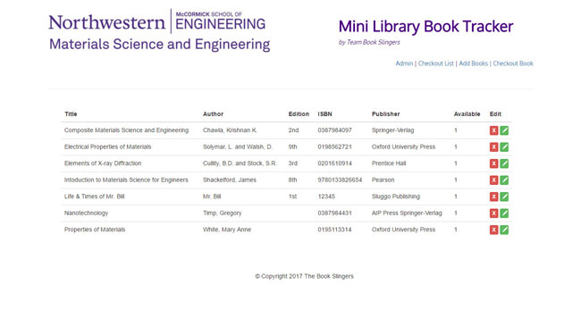

# Mini Library Book Tracker 

A full-stack library application that uses javascript (node.js, express.js, handlebars.js) and a MySQL database to track books loaned out to students and faculty at the Northwestern University, McCormick School of Engineering, Department of Material Science and Engineering. 





### Project Status - In Process, last updated 9/16/2017

----

### Table of Contents

  -  Mini Library Book Tracker Description
  -  Features to have 
  -  Features to create if time or for future uses
  -  Technologies used for this project
  -  Dependencies
  -  How to setup and use this app
  -  File and directory structure
  -  Revision history

----

### Mini Library Book Tracker Description
App & Device can be used to monitor weather conditions in agricultural, industrial or commercial applications and can be expanded to monitor numerous other types of data according to the need of the client, market and by sensors available. 


----

### Features to have

- Ability to create, edit and delete records in admin section

- Public has ability to view available books


----

### Features to create if time or for future uses

- Google Authentication for login

- Printing report of checked out books


----

### Technologies used for this project

Description of technologies used to develop this app.

- Node.js

- Express.js

- Handlebars.js

- Custom made ORM

- MySQL Database

- All of them are transitive dependencies of the provided npm package.

---- 

### Dependecies

    body-parser: 1.17.1,
    express: 4.15.2,
    express-handlebars: 3.0.0,
    handlebars: 4.0.8,
    method-override: 2.3.8,
    mysql: 2.13.0

----

### How to setup and use this app 

1. Open your command-line user interface (CLI)

2. Clone the <em>mlbt</em> repository to your computer in your desired file path

3. Configure the <code>connection.js</code> file to your MySQL Workbench settings

4. Type <code>node server.js</code> in CLI to connect to the server

5. For client-side view: Enter <code>http://localhost:3000</code> in the URL bar to view it in the browser. For administrator view: add <code>/admin</code> or <code>/crud</code> paths to the local host URL to load administrator-side pages.

----


### File and directory structure

```
.
├── config
│   │
│   ├── connection.js
│   │
│   └── orm.js
│ 
├── controllers
│   │
│   └── mlbtracker_controller.js
│
├── db
│   │
│   ├── schema.sql
│   │
│   └── seeds.sql
│
├── models
│   │
│   └── mlbtracker.js
│ 
├── package.json
│
├── public
│   │
│   ├── assets
│   │   │
│   │   ├── css
│   │   │
│   │   │   └── mlbtracker_style.css
│   │   │
│   │   └── images
│   │       |
│   │       ├── addbook.jpg
│   │       │
│   │       ├── admin.jpg
│   │       │
│   │       ├── index.jpg
│   │       │
│   │       └── logo.jpg
│   │
│   └── test.html
│
├── server.js
│
└── views
    │       
    ├──layouts
    │      │
    │      └── main.handlebars
    │ 
    └── bookcheckout.handlebars
          │
          ├── bookcrud.handlebars
          │
          ├── checkout.handlebars
          │
          ├── index.handlebars
          │
          └── usercrud.handlebars
```

----

### Revision History 

Description of revisions made to the app - In Process, last updated 9/16/2017

  - [x] Wireframe project
  - [x] Researched project
  - [x] File layout and database structure
  - [x] Coded project
  - [x] Cleaned up code
  
  
  